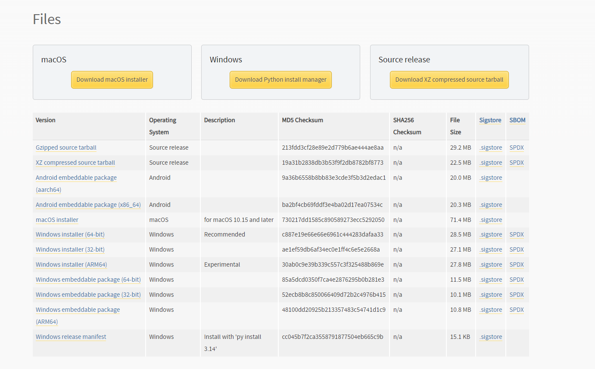

# Installing Python

Many modern computers already have Python installed, so this step can likely be skipped. 

To check, go to a terminal by either typing `cmd` into the Start menu on Windows, or opening the terminal app from the macOS applications menu.

In that terminal, type the command as shown:

(Windows)
```sh
C:\Users\Your Name>python --version
```

(Mac/Linux)
```sh
python --version
```

If you get an error and python is not installed, then go to [https://www.python.org/](https://www.python.org/), go to the **Downloads** section, and download the appropriate version of python for your computer.

The download screen *should** look something like this:



***Note that this could potentially change, if so make a Github Issue on the [repo](https://github.com/mohamed-morsy33/python_101)!**
